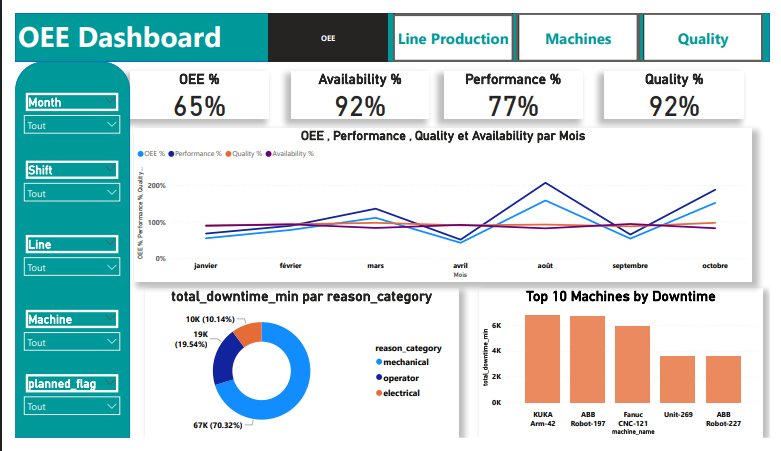

# 📊 Manufacturing OEE Analytics 

## 🔎 Project Overview
This project presents an end-to-end analytics solution for monitoring manufacturing efficiency using **Overall Equipment Effectiveness (OEE)** metrics. The dashboard provides operational insights into production performance, machine reliability, downtime causes, and product quality across multiple production lines.

The solution helps manufacturing organizations identify performance bottlenecks, reduce downtime, and improve product quality through data-driven decision-making.

---

## 🧰 Tools & Technologies
- **Python** → Data cleaning, transformation, and preprocessing  
- **SQL** → Data extraction and aggregation from production databases  
- **Power BI** → Interactive dashboard development and data visualization  

---

## 🤖 AI-Assisted Development
- **ChatGPT** → was used to help identify industry-relevant KPIs and ensure alignment with real-world business performance metrics.
- **Claude** → was used to assist in refining Python and SQL logic, improving code structure, and accelerating development workflows.
---

## ⚙️ Analytics Workflow

### 1️⃣ Data Extraction
- Production data retrieved using SQL queries  
- Machine logs and downtime records integrated  

### 2️⃣ Data Processing
- Data cleaning and transformation using Python  
- Feature engineering for OEE components  

### 3️⃣ Data Modeling
- Structured data model for production lines, machines, and shifts  
- KPI calculations for operational performance  

### 4️⃣ Visualization
- Interactive Power BI dashboards for monitoring manufacturing performance  

---

## 📈 Key Performance Indicators (KPIs)

### 🏭 Production Efficiency
- **Overall Equipment Effectiveness (OEE): 65%**  
- **Availability: 92%**  
- **Performance: 77%**  
- **Quality Rate: 92%**

### 🔧 Reliability & Maintenance
- **Total Downtime: 138K minutes**  
- **Mean Time to Repair (MTTR): 1.36K minutes**  
- **Mean Time Between Repairs (MTBR): 521.94 minutes**

### 🧪 Quality Metrics
- **Scrap Rate: 8.03%**  
- **Defect Rate: 11%**  
- **Total Defective Units: 10K**

### 📊 Operational Analysis
**Downtime categorized by:**
- Mechanical issues  
- Operator-related issues  
- Electrical failures  

**Performance comparison across:**
- Machines  
- Production lines  
- Machine types  
- Time periods  

---

## 🏭 Business Value
This dashboard enables organizations to:

- ✔ Identify root causes of production downtime  
- ✔ Improve equipment utilization  
- ✔ Optimize maintenance planning  
- ✔ Reduce scrap and defect rates  
- ✔ Monitor production efficiency in real time  
- ✔ Support continuous improvement initiatives  

---

## 🎯 Target Industries
- Manufacturing  
- Industrial Automation  
- Automotive Production  
- Electronics Manufacturing  
- Smart Factory Operations  

---

## 📊 Dashboard Features
- Machine-level performance monitoring  
- Production line efficiency analysis  
- Downtime root cause analysis  
- Quality and defect tracking  
- Maintenance performance indicators  

**Interactive filtering by:**
- Machine  
- Line  
- Shift  
- Month  
- Planned vs Unplanned downtime  

---

## 🚀 How This Project Supports Decision-Making
By combining operational efficiency metrics with quality and maintenance insights, this solution provides a unified view of manufacturing performance. Decision-makers can quickly detect inefficiencies, prioritize maintenance actions, and implement process improvements that directly impact productivity and cost reduction.
